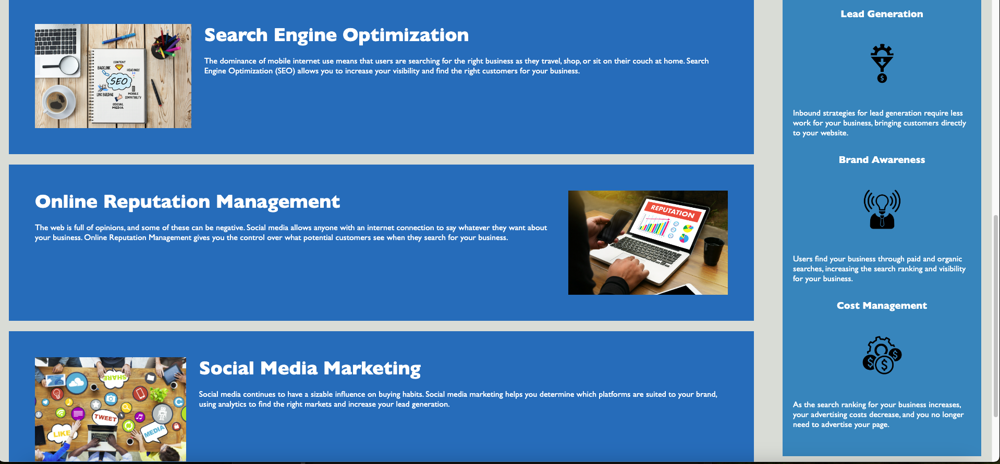
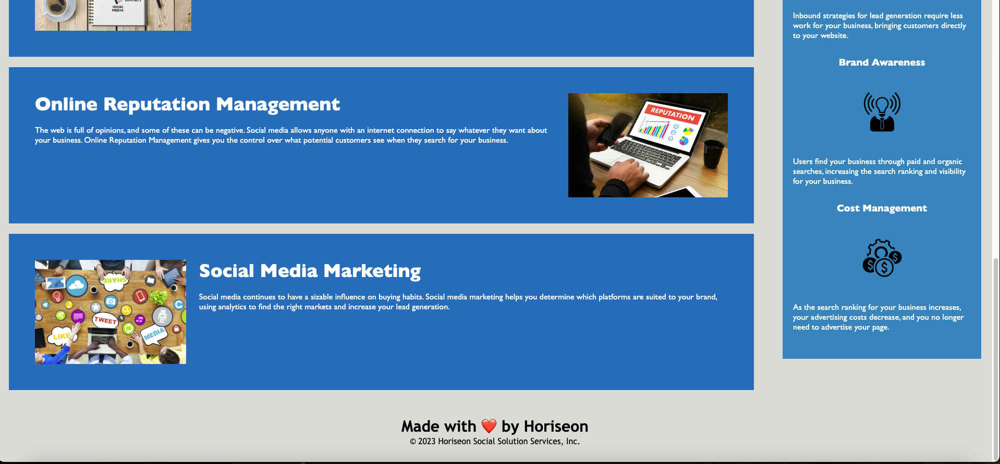

# Horiseon Refactoring

## Description
For this project, we as developers wanted to take already written, functional code and make it betterby adding semantic elements in the html, creating structure for the css code, adding comments to make the code more understandable, and adding readability to specific parts of code  so that people with certain disibilities can be included when visiting the website and navigating it as well. This project was built so that we as developers could learn refactoring, so that we can write better code. This project solves the problem of having better code that is more easily readable to optimize the website for search engines. I learned from this project how to properly add structure to html and css by creatic semantic elements and organizing the code with comments to make it easier for other developers to read and understand. 

## Credits 
A tutor helped me, Jehyun Jung, who looked over my code and helped me with some areas that my code was lacking in. For example, my id's in my html, the tutor helped by pointing out that I needed those in order for the links to go to specific sections of the page when clicked by the user. He also looked over my code to make sure I was on the right track.

## Technologies 
Html, CSS

## Questions
For any questions, please reach out by creating an issue.

## Deployment Section
https://brianguthrie88.github.io/refactoring/

